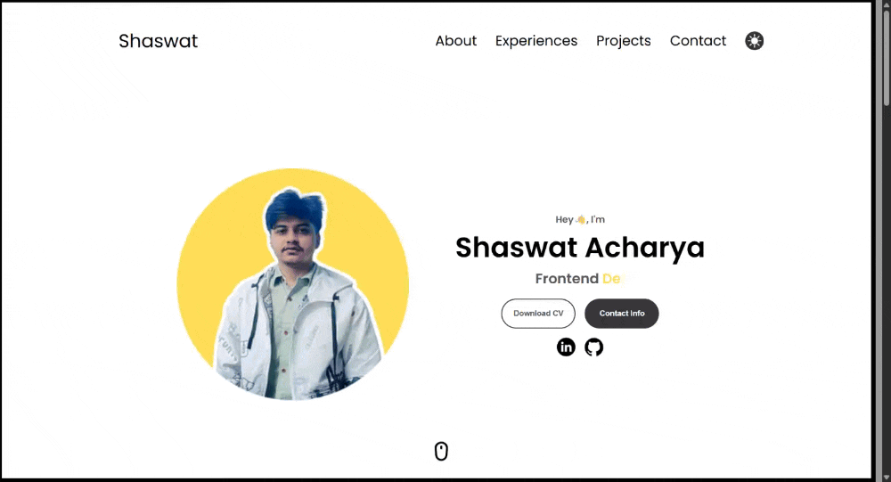
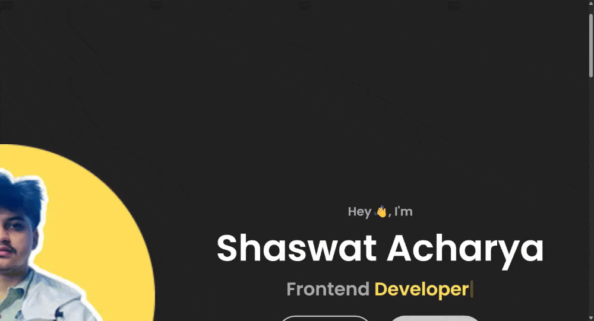

# 🌐 **Personal Portfolio - Shaswat Acharya**

A clean, minimal, and responsive one-page portfolio website showcasing my experience, skills, and projects — built with love, code, and a hint of design flair.

🔗 **Live Site**: [shaswatacharya.com.np](https://shaswatacharya.com.np)

---

## ✨ **Features**

- 🔁 **Smooth Scrolling Navigation** – Intuitive scrolling for seamless browsing.
- 🌙 **Custom-built Dark Mode Toggle** – Easily switch between light and dark themes for a personalized experience.
- 🎯 **Animated Custom Cursor** – Engaging, interactive cursor animation for a modern UI.
- 🖼️ **Optimized for SEO and Social Sharing** – Includes Open Graph tags and Twitter Cards for better sharing.
- 📱 **Fully Responsive** – The site is designed to work beautifully across all screen sizes.
- ⚡ **Fast Loading** – Optimized for speed with a clean, minimal design for efficient user experience.

---

## 🖼️ Visual Preview of Key Features

<!-- Light & Dark Theme GIFs Side-by-Side -->
### 🌞 Light Theme Preview

  

### 🌙 Dark Theme Preview

  

### 🖱️ Custom Cursor Preview

  

> ⚡ These previews are actual screen-recorded GIFs showcasing the interactive design in real-time.

---

## 🛠️ **Tech Stack**

- **HTML5** – The foundation for structure and semantics.
- **CSS3** (Flexbox + Media Queries) – Responsive and flexible layout for all screen sizes.
- **JavaScript** (Vanilla) – Dynamic functionality with pure JavaScript, no libraries.
- **Favicon**, **Web Manifest**, **Apple Touch Icons** – Ensuring a polished experience across all devices.
- **Schema Markup** (Structured Data for SEO) – Boosts search engine visibility with structured data.

---

## 🧑‍💻 **About Me**

I’m **Shaswat Acharya**, a Frontend Developer & IT student from Nepal, passionate about transforming creative ideas into beautiful and functional user experiences.  
Let’s connect:  
  

---

## 📬 **Feedback / Suggestions**

Found a bug or want to suggest an improvement?  
Feel free to [open an issue](https://github.com/shaswatacharya/your-repo-name/issues) or reach out via [LinkedIn](https://www.linkedin.com/in/shaswatacharya).

---

> Designed & Developed with ❤️ by Shaswat Acharya  
